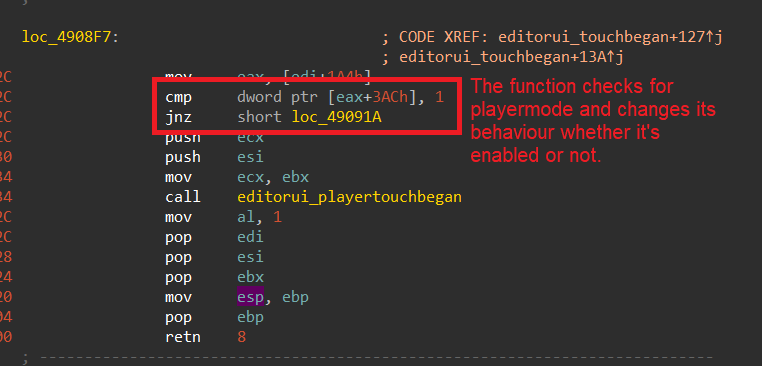

# editorFreezeFix

### The problem

When using the editor, creators might accidentally hit the playtest key when placing objects: since the action of clicking is used by both normal mode and playtest mode, this causes a race condition where the editor switches to playtest mode (`EditorUI->0x1A4->0x3AC`) before the action of placing the object occurs. The state of the editor is then inconsistent, because it thinks we're constantly placing an object, and we cannot place more.

### The fix

The fix is very simple: we check for the user click action, and we prevent the editor from entering playtest mode if the action is not done (for experts: if `ccTouchEnded()` is not done yet).

### Credits

Huge thanks to [night](https://twitter.com/uwunight_), who has asked me to fix this bug in the first place, and who told me a consistent way of reproducing it!